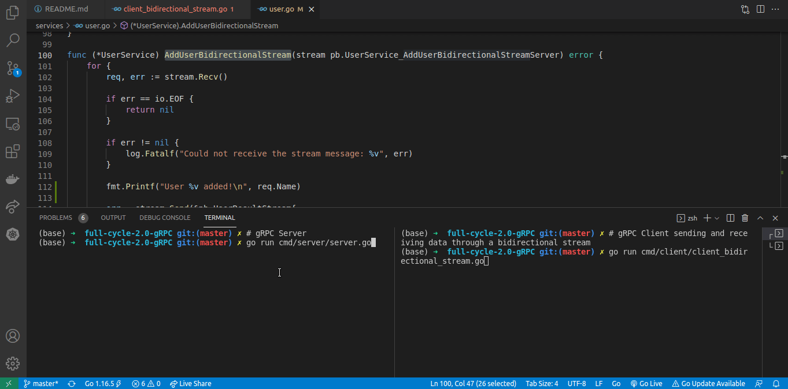

# full-cycle-2.0-gRPC

Files I produced during the gRPC classes of my [Microservices Full Cycle 2.0 course](https://drive.google.com/file/d/1MdN-qK_8Pfg6YI3TSfSa5_2-FHmqGxEP/view?usp=sharing).

## Protocol Buffers

Language Guide: https://developers.google.com/protocol-buffers/docs/proto3

To compile .proto files, install it's compiler:

```sh
sudo apt install -y protobuf-compiler
```

As this example is in the Go language, install it and then install protoc-gen-go-grpc:

```sh
go get google.golang.org/protobuf/cmd/protoc-gen-go google.golang.org/grpc/cmd/protoc-gen-go-grpc
```

Make sure your go binaries are in your PATH variable. In my case they are at `$HOME/go/bin`.

To generate the Golang code for gRPC communication run:

```sh
protoc --proto_path=proto proto/*.proto --go_out=pb --go-grpc_out=pb
```

## Running the server

```sh
go run cmd/server/server.go
```

## evans gRPC Client

Get the binary release from the evans repo: https://github.com/ktr0731/evans/releases and put it in your binaries folder. Ex.: /usr/bin

Now, run:

```sh
evans -r repl --host localhost --port 50051
```

Inside the evans console, run:

```sh
service UserService  # Set the service we will use
call AddUser  # Calls the AddUser function from UserService

# Then enter the values of the Id (server will ignore), Name and Email
```

## My own gRPC Client in Go

To test it, run:

```sh
go run cmd/client/client.go
```

## My own gRPC Client in Go receiving the server stream

To test it, run:

```sh
go run cmd/client/client_receiving_stream.go
```

## My own gRPC Client in Go sending data through a stream

To test it, run:

```sh
go run cmd/client/client_sending_stream.go
```

## My own gRPC Client and Server using a bidirectional stream

To test it, run:

```sh
go run cmd/client/client_bidirectional_stream.go
```

Animation:


